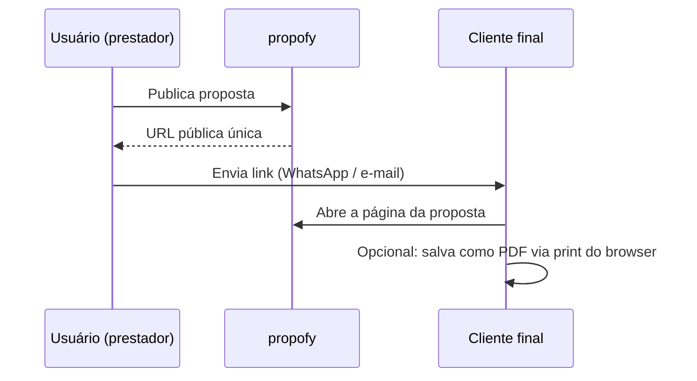

# ADR-002: Entrega da proposta — link compartilhável com print CSS

| Field | Value |
|---|---|
| **Status** | Proposed |
| **Date** | 2026-07-15 |
| **Decision makers** | Luiz |
| **Related scopes** | [SCOPE-002](../scopes/SCOPE-2026-15-07-fluxo-do-documento-comercial.md) |

## Contexto

O artefato final do propofy — a proposta ou orçamento gerado — precisa chegar ao cliente do usuário. As formas usuais são PDF anexado ou link. A decisão impacta infraestrutura, custo e a própria natureza do produto.

Restrições relevantes (ver ADR-001):

- Plano free da Vercel impõe limites de tamanho de bundle e tempo de execução em funções serverless, o que penaliza geração de PDF via browser headless.
- O v1 deve manter custo zero e o mínimo de superfícies de manutenção.
- Tracking de abertura pelo cliente final é uma feature desejada de futuro próximo, relevante para o usuário saber se a proposta foi vista.

## Decisão

A proposta é entregue como **página pública com link compartilhável**, e a exportação em PDF é feita **pelo próprio browser via print CSS** dedicado.

- Cada documento publicado gera uma URL pública não-indexável, com identificador não sequencial e não adivinhável.
- A página pública é a representação canônica da proposta: responsiva, com a identidade visual do usuário (logo, cores) e otimizada para leitura em celular.
- Um stylesheet de impressão garante que o comando de imprimir/salvar como PDF do browser produza um documento paginado limpo (sem elementos de navegação, com quebras de página corretas e cabeçalho/rodapé adequados).
- A interface oferece um botão explícito de "Baixar PDF" que aciona o fluxo de impressão do browser, para que o usuário leigo não precise conhecer o atalho.

## Alternativas consideradas

**PDF programático server-side (@react-pdf/renderer ou similar).** Viável no plano free, mas exige manter dois layouts em tecnologias distintas — o da página web e o do PDF em DSL própria — duplicando o custo de cada mudança visual. Rejeitado para o v1; é o caminho natural caso a demanda por PDF nativo se confirme (v1.1).

**Browser headless serverless (Playwright/Chromium).** Produz PDF pixel-perfect a partir do mesmo HTML, mas conflita diretamente com os limites de bundle e cold start do plano free da Vercel. Rejeitado enquanto a restrição de custo zero vigorar.

**PDF como artefato único (sem página pública).** Rejeitado: perde o tracking de abertura futuro, perde a experiência mobile do cliente final e transforma cada revisão da proposta em um novo arquivo a reenviar, em vez de uma página que se atualiza.

## Consequências

**Positivas:**

- Zero infraestrutura adicional de geração; nenhum limite de plano free é pressionado.
- Um único layout a manter; toda melhoria visual beneficia web e PDF simultaneamente.
- O link como artefato principal habilita o tracking de abertura futuro sem retrabalho.
- Proposta abre bem no celular, canal dominante do público-alvo (WhatsApp).

**Negativas / riscos aceitos:**

- O PDF resultante depende do motor de impressão do browser do cliente; pequenas variações de renderização são aceitas.
- Parte do público pode esperar receber um arquivo anexado e estranhar o link; mitigação: botão explícito de download na página e comunicação clara no produto. Caso a fricção se confirme na validação, a alternativa de PDF programático é promovida a v1.1.
- Página pública exige cuidado com URLs não adivinháveis e com a decisão de expiração/revogação de link, que deve ser coberta nos scenarios do scope da feature.
