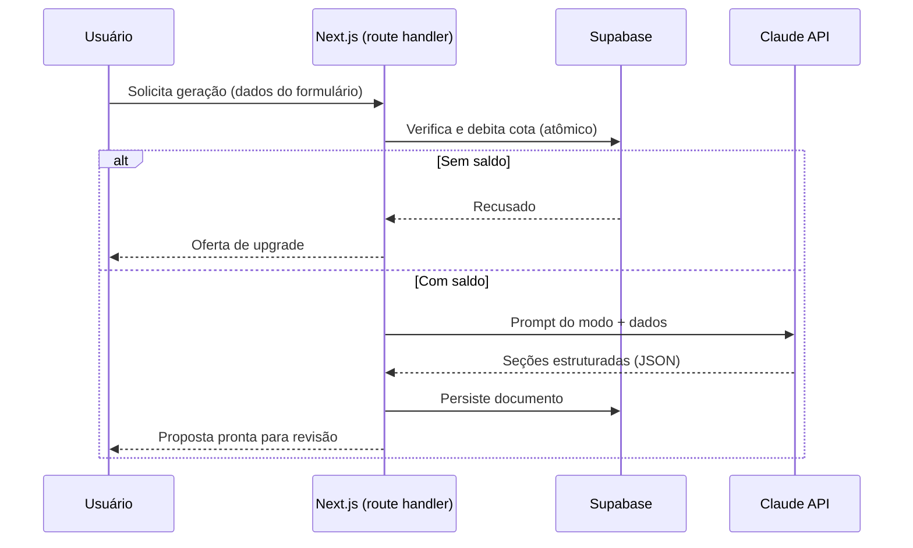

# ADR-003: Estratégia de geração de conteúdo com LLM

| Field | Value |
|---|---|
| **Status** | Proposed |
| **Date** | 2026-07-15 |
| **Decision makers** | Luiz |
| **Related scopes** | [SCOPE-002](../scopes/SCOPE-2026-15-07-fluxo-do-documento-comercial.md) |

## Contexto

A geração do texto da proposta/orçamento é o core de valor do propofy. As decisões desta ADR determinam custo variável por usuário, qualidade percebida do produto e a viabilidade do modelo freemium.

Fatores relevantes:

- Cada geração tem custo real de API; o plano freemium (N gerações gratuitas) é a barreira de contenção de custo e precisa ser tecnicamente confiável.
- A chave de API não pode ser exposta ao cliente; toda geração é server-side (ADR-001).
- O produto tem dois modos com tons distintos — proposta formal e orçamento rápido — sobre a mesma estrutura de dados.
- O público escreve entradas curtas e informais; a qualidade da saída não pode depender de o usuário escrever bem.

## Decisão

- **Provedor e modelo:** Claude API, com modelo da família Sonnet como padrão — equilíbrio entre qualidade de escrita em PT-BR e custo por geração. A escolha de modelo fica isolada em configuração, permitindo troca sem mudança de arquitetura.
- **Execução server-side** em route handler do Next.js, nunca no cliente.
- **Saída estruturada:** o modelo retorna as seções da proposta em formato estruturado (JSON), e não texto corrido. A aplicação é dona do layout; o LLM é dono apenas do conteúdo das seções. Isso mantém o documento editável seção a seção e independente do formato de entrega (ADR-002).
- **Prompt por modo:** um prompt base compartilhado com variações de tom por modo (formal para proposta, direto para orçamento), ambos em PT-BR, incorporando os dados do formulário e o perfil do usuário (nome do negócio, segmento).
- **Controle de cota antes da geração:** a verificação e o débito da cota freemium ocorrem atomicamente no banco antes da chamada à API. Falha na geração após débito devolve a cota. Nenhuma chamada à API ocorre para usuário sem saldo.
- **Sem streaming no v1:** a geração retorna completa. O documento é curto o suficiente para latência aceitável, e a saída estruturada simplifica sem streaming. Streaming é otimização de UX futura, não requisito.
- **Edição pós-geração é da aplicação, não do LLM:** o usuário edita o texto gerado diretamente; regeneração conta como nova geração para fins de cota.

## Alternativas consideradas

**Geração de texto corrido (markdown/HTML livre).** Rejeitado: acopla o conteúdo ao layout, dificulta edição por seção e torna o print CSS (ADR-002) refém do que o modelo decidir produzir.

**Modelo de maior capacidade (família Opus) como padrão.** Rejeitado como padrão: o custo por geração inviabiliza o freemium. A configuração isolada de modelo permite experimentos pontuais.

**Cota verificada apenas no cliente ou após a geração.** Rejeitado: verificação no cliente é contornável e verificação posterior gera custo de API para usuário sem saldo — exatamente o cenário que o freemium precisa impedir.

**Streaming da resposta no v1.** Rejeitado por ora: adiciona complexidade de parsing incremental de saída estruturada sem ganho proporcional em documento curto.

## Consequências

**Positivas:**

- Custo variável rigidamente acoplado à cota; sem caminho para geração não contabilizada.
- Documento estruturado por seções viabiliza edição granular, templates por modo e evolução de layout sem tocar na geração.
- Troca de modelo (ou de provedor, no limite) isolada em um ponto do sistema.

**Negativas / riscos aceitos:**

- Latência de geração sem streaming é percebida como espera única; mitigação de UX (indicador de progresso) é responsabilidade do scope da feature.
- Saída estruturada exige validação de schema da resposta do modelo e tratamento de resposta malformada, com política de retry — cenário obrigatório nos BDD scenarios da feature de geração.
- Dependência de um único provedor de LLM no v1; aceito pelo isolamento da configuração.
