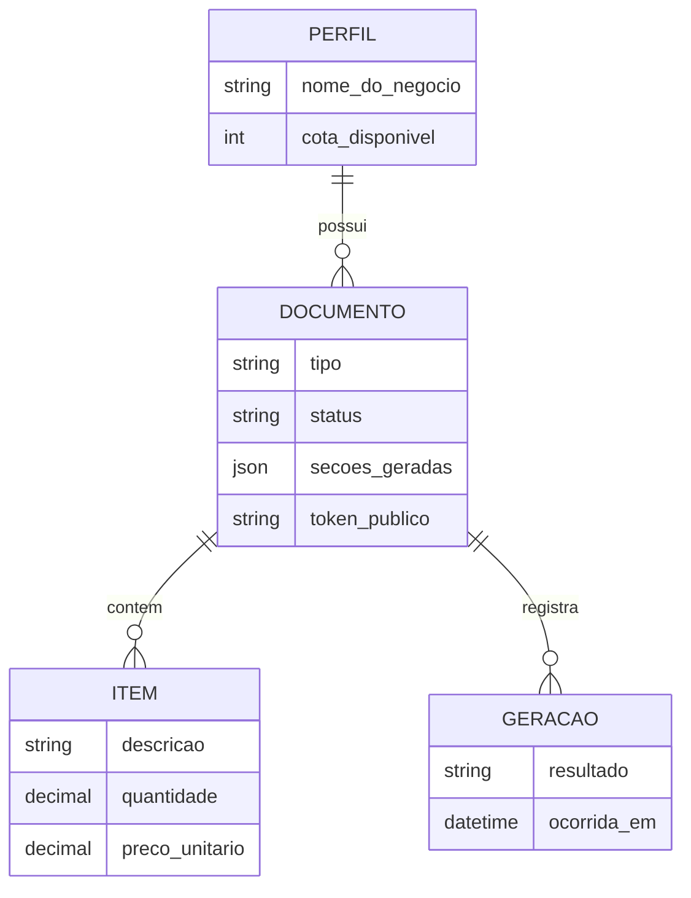

# ADR-004: Modelo de dados do documento comercial

| Field | Value |
|---|---|
| **Status** | Proposed |
| **Date** | 2026-07-15 |
| **Decision makers** | Luiz |
| **Related scopes** | [SCOPE-002](../scopes/SCOPE-2026-15-07-fluxo-do-documento-comercial.md) |

## Contexto

O propofy oferece dois modos — proposta formal e orçamento rápido — que compartilham a mesma essência: um documento comercial com cliente, itens de valor e texto gerado por IA, publicado como link. A modelagem precisa atender os dois casos de precificação do público (serviço puro com valor único; serviço + produtos com quantidades), sustentar o ciclo rascunho → publicado → despublicado e registrar gerações para o controle de cota (ADR-003).

## Decisão

**Uma única entidade de documento para os dois modos**, diferenciada por um campo de tipo. Proposta e orçamento não são tabelas nem fluxos distintos; são o mesmo agregado com template de geração e tom diferentes.

Estrutura do agregado:

- **Documento:** pertence a um perfil; carrega tipo (proposta | orçamento), dados do cliente destinatário, contexto adicional fornecido pelo usuário, as **seções de texto geradas** (estrutura JSON definida pela aplicação, produzida pelo LLM conforme ADR-003 e editável pelo usuário), status do ciclo de vida (rascunho | publicado | despublicado) e, quando publicado, um **token público não sequencial e não adivinhável** que compõe a URL da página pública.
- **Item:** registros relacionados ao documento, com descrição, quantidade (default 1) e preço unitário. Subtotais e total são derivados, nunca armazenados como fonte de verdade. O caso "serviço puro" é um documento com um único item de quantidade 1 — nenhum tratamento especial.
- **Geração:** registro de cada chamada de geração vinculada ao documento (sucesso ou falha), sustentando o débito/estorno atômico de cota da ADR-003 e a auditoria de consumo do freemium.

## Alternativas consideradas

**Entidades separadas para proposta e orçamento.** Rejeitado: duplica formulário, geração, publicação e página pública para variações que são de conteúdo e tom, não de estrutura. A separação correta vive no template de prompt e na apresentação.

**Valores como texto livre.** Rejeitado como espinha dorsal: impede totais calculados, aparência profissional consistente e evoluções (desconto, impostos) sem retrabalho. O campo livre existe, mas como complemento ("condições de pagamento"), não como fonte dos valores.

**Texto gerado como blob único.** Rejeitado: já descartado na ADR-003; seções estruturadas são pré-requisito da edição granular e do layout controlado pela aplicação.

**Total armazenado no documento.** Rejeitado: valor derivado dos itens; armazenar duplicaria a fonte de verdade e criaria inconsistência a cada edição.

## Consequências

**Positivas:**

- Um único fluxo de código para os dois modos; adicionar um terceiro modo futuro (ex.: contrato simples) é adicionar um tipo e um template, não um subsistema.
- Modelagem de itens acomoda do freelancer ao prestador com material, sem fricção para o caso simples.
- O registro de gerações torna o consumo de cota auditável e o estorno em falha verificável.

**Negativas / riscos aceitos:**

- A estrutura JSON das seções exige disciplina de versionamento interno (documentos antigos precisam continuar renderizáveis se a estrutura evoluir); aceito com a convenção de mudanças aditivas.
- Página pública lê o perfil vigente (nome do negócio): alterações de perfil refletem em documentos já publicados. Aceito no v1; snapshot no momento da publicação é evolução futura se incomodar.
