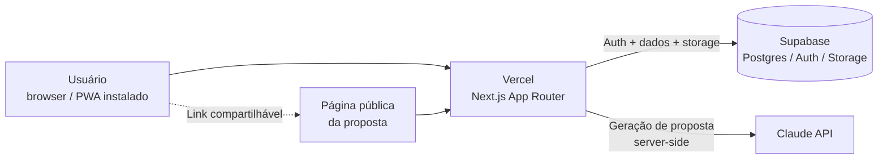

# ADR-001: Stack e infraestrutura

| Field | Value |
|---|---|
| **Status** | Proposed |
| **Date** | 2026-07-15 |
| **Decision makers** | Luiz |
| **Related scopes** | [SCOPE-001](../scopes/SCOPE-2026-15-07-fundacao-do-projeto.md), [SCOPE-002](../scopes/SCOPE-2026-15-07-fluxo-do-documento-comercial.md) |

## Contexto

O propofy é um micro-SaaS de geração de propostas comerciais e orçamentos com IA, voltado ao mercado brasileiro (PT-BR), desenvolvido por um único engenheiro com objetivo de lançamento rápido e custo de operação próximo de zero no v1.

Restrições que orientam a decisão:

- **Custo zero de infraestrutura no v1.** O produto nasce freemium e sem receita; qualquer custo fixo de hosting inviabiliza o experimento.
- **Velocidade de lançamento.** O valor do projeto depende de ir ao mercado em dias, não meses. A stack deve ser a de maior familiaridade do desenvolvedor.
- **Desenvolvimento em macOS com armazenamento limitado.** Simuladores iOS e toolchain nativa (Xcode) são inviáveis no ambiente atual. Isso elimina apps nativos como opção de v1.
- **Domínio já disponível** (propofy.app), sem custo adicional.
- **Geração de conteúdo via LLM** é o core do produto e exige backend server-side para proteger chaves de API (detalhado em ADR futura).

## Decisão

Adotar a seguinte stack:

| Camada | Escolha |
|---|---|
| Framework web | Next.js (App Router), full-stack |
| Distribuição mobile | PWA (instalável, sem app stores) |
| Banco de dados | Supabase (PostgreSQL) |
| Autenticação | Supabase Auth |
| Storage de arquivos | Supabase Storage |
| Hosting e deploy | Vercel (plano free) |
| Geração de texto | Claude API, chamada server-side via route handlers do Next.js |
| Migrations e ambiente local | Supabase CLI |

## Alternativas consideradas

**App nativo iOS (via Dhrive ou Swift direto).** Rejeitado para o v1: o ambiente de desenvolvimento atual não comporta simuladores, o ciclo de publicação em app store adiciona dias ou semanas ao lançamento, e o público-alvo (prestadores de serviço) é alcançável por web/PWA sem perda relevante de experiência.

**Backend separado (NestJS + frontend React).** Rejeitado: adiciona um deploy, um repositório lógico e uma superfície de manutenção a mais sem benefício para o escopo do v1. Os route handlers do Next.js cobrem as necessidades de backend (chamadas à Claude API, webhooks futuros de pagamento).

**Site builder / WordPress + plugins.** Rejeitado: o core do produto é lógica customizada de geração com LLM e controle de cota freemium, que não se expressa bem em builders. A vantagem de velocidade desaparece na primeira feature não trivial.

**Firebase em vez de Supabase.** Rejeitado: o desenvolvedor tem proficiência estabelecida em PostgreSQL e já opera Supabase em outro projeto ativo. Postgres relacional também modela melhor a relação usuário → documentos → itens → gerações, e mantém portabilidade futura.

## Consequências

**Positivas:**

- Custo de operação zero até haver volume real de usuários (limites dos planos free de Vercel e Supabase são suficientes para validação).
- Uma única base de código e um único deploy; ciclo de iteração mínimo.
- PWA elimina dependência de app stores e do ambiente de desenvolvimento nativo.
- Stack integralmente dentro da zona de proficiência do desenvolvedor; nenhuma tecnologia nova a aprender durante o sprint de lançamento.

**Negativas / riscos aceitos:**

- Funções serverless da Vercel têm limites de tempo de execução e tamanho de bundle no plano free; isso restringe abordagens pesadas de geração de PDF server-side (trade-off tratado em ADR dedicada).
- PWA em iOS tem limitações conhecidas (notificações push restritas, instalação menos descobrível). Aceito: nenhuma funcionalidade do v1 depende desses recursos.
- Plano free do Supabase pausa projetos inativos após período sem uso; risco irrelevante durante desenvolvimento ativo, mas exige atenção se o produto ficar dormente.
- Chamadas à Claude API têm custo variável por geração; o controle de cota do freemium é a mitigação e é requisito de produto desde o v1.
