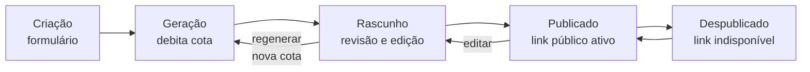

# Scope: Fluxo do documento comercial

| Field | Value |
|---|---|
| **Status** | Ready |
| **Date** | 2026-07-15 |
| **Author** | Luiz |
| **Related ADRs** | [ADR-002: Entrega da proposta](../adr/ADR-2026-15-07-entrega-da-proposta-link-e-print-css.md), [ADR-003: Estratégia de geração com LLM](../adr/ADR-2026-15-07-estrategia-de-geracao-com-llm.md), [ADR-004: Modelo de dados do documento](../adr/ADR-2026-15-07-modelo-de-dados-do-documento.md) |
| **Target branch** | feat/fluxo-de-documento |

## Problema

A fundação (SCOPE-001) entrega um usuário autenticado com cota, mas o core do produto ainda não existe: transformar dados brutos (cliente, itens, contexto) em um documento comercial profissional — proposta formal ou orçamento rápido — publicável como link que o cliente final abre no celular.

## Resultado desejado

Um usuário autenticado cria um documento no modo desejado, recebe o texto gerado pela IA, revisa e edita à vontade, publica e envia o link pelo canal que preferir (WhatsApp em primeiro lugar). O cliente final abre uma página profissional, mobile-first, e pode salvá-la como PDF.

## Non-goals

- Pagamento e upgrade de plano — scope próprio, último da sequência do v1.
- Tracking de abertura da página pública pelo cliente final.
- Customização visual do documento (logo, cores) — o documento usa a identidade padrão do propofy com o nome do negócio do usuário.
- Múltiplos templates por modo — um template de geração por modo no v1.
- Envio direto por e-mail/WhatsApp pelo sistema — o usuário copia o link e envia por conta própria.
- Duplicação de documentos e histórico de versões.

## Ciclo de vida do documento

## Feature: Criação e geração

### S1 — Criação e geração (happy path)

- **Given** um usuário autenticado com saldo de cota
- **When** escolhe o modo (proposta ou orçamento), preenche dados do cliente, itens (descrição, quantidade default 1, preço unitário) e contexto adicional, e aciona gerar
- **Then** a cota é debitada atomicamente, as seções de texto são geradas conforme o tom do modo, e o documento fica em rascunho na tela de revisão, com totais calculados a partir dos itens

### S7 — Geração sem saldo é recusada antes da API

- **Given** um usuário autenticado sem saldo de cota
- **When** aciona gerar
- **Then** nenhuma chamada ao LLM ocorre e o usuário é levado à tela de limite atingido

### S8 — Falha na geração estorna a cota

- **Given** uma geração cujo débito de cota foi efetuado
- **When** a chamada ao LLM falha
- **Then** a cota é estornada, o usuário é informado com opção de tentar novamente, e a falha fica registrada na entidade de geração

### S9 — Resposta malformada tem retry transparente

- **Given** uma geração em andamento
- **When** a resposta do LLM não passa na validação de estrutura
- **Then** o sistema tenta novamente de forma transparente; persistindo a falha, aplica-se o estorno e a comunicação de S8

## Feature: Revisão e edição

### S2 — Edição do rascunho

- **Given** um documento em rascunho
- **When** o usuário edita o texto de qualquer seção ou altera itens
- **Then** as mudanças são persistidas e os totais recalculados, sem consumo de cota

### S3 — Regeneração consome cota com aviso

- **Given** um documento em rascunho e usuário com saldo
- **When** aciona regenerar
- **Then** vê aviso claro de que a ação consome uma geração antes de confirmar; ao confirmar, o fluxo de geração (S1) se repete sobre os dados atuais, substituindo as seções

### S10 — Rascunho não é acessível publicamente

- **Given** um documento em rascunho ou despublicado
- **When** qualquer pessoa tenta acessar sua URL pública
- **Then** a página informa que o documento não está disponível, sem vazar conteúdo ou existência de dados

## Feature: Publicação e página pública

### S4 — Publicação gera link único

- **Given** um documento em rascunho
- **When** o usuário publica
- **Then** um token público não sequencial e não adivinhável é atribuído (na primeira publicação) e o usuário recebe a URL pronta para copiar, com atalho de compartilhamento

### S5 — Página pública com download em PDF

- **Given** um documento publicado
- **When** o cliente final abre o link em qualquer dispositivo
- **Then** vê a página mobile-first com nome do negócio, dados do cliente, seções de texto, itens com totais e condições; o botão "Baixar PDF" aciona o fluxo de impressão do browser com print CSS que produz documento paginado limpo

### S6 — Despublicação

- **Given** um documento publicado
- **When** o usuário despublica
- **Then** a URL pública passa a responder como indisponível (comportamento de S10) e o usuário pode republicar mantendo o mesmo token

## Feature: Limite do freemium

### S11 — Cota esgotada captura interesse no plano pago

- **Given** um usuário na tela de limite atingido
- **When** registra interesse no plano pago (contato/WhatsApp)
- **Then** o interesse é persistido para contato posterior e o usuário é informado de que será avisado do lançamento do plano

## Constraints e contexto

- Interface em PT-BR, mobile-first, dentro dos planos free (ADR-001).
- O modelo de dados segue a ADR-004; o débito/estorno de cota segue a ADR-003; a entrega segue a ADR-002.
- A estrutura das seções geradas é definida pela aplicação e validada na resposta do LLM (ADR-003); os prompts por modo fazem parte deste scope.
- A URL pública não deve ser indexável por buscadores.

## Milestones

### M1 — Modelo de dados

Migrations das entidades documento, item e geração conforme ADR-004, compatíveis com a cota criada no SCOPE-001. Pré-requisito de todos os scenarios; nenhum satisfeito diretamente.

### M2 — Criação e geração ponta a ponta

Formulário de criação (modo, cliente, itens, contexto), prompts por modo, chamada de geração com débito de cota e chegada ao rascunho. Satisfaz: S1, S10.

### M3 — Revisão e edição

Edição de seções e itens com recálculo, e regeneração com confirmação. Satisfaz: S2, S3.

### M4 — Publicação e página pública

Publicação com token, página pública mobile-first, print CSS e despublicação. Satisfaz: S4, S5, S6. **Marco de demonstração:** ao final deste milestone o produto é testável de ponta a ponta com um usuário real.

### M5 — Estados de erro e limite

Recusa sem saldo, estorno em falha, retry de resposta malformada e tela de limite com captura de interesse. Satisfaz: S7, S8, S9, S11.
